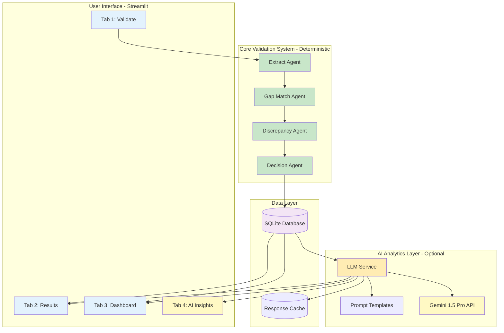
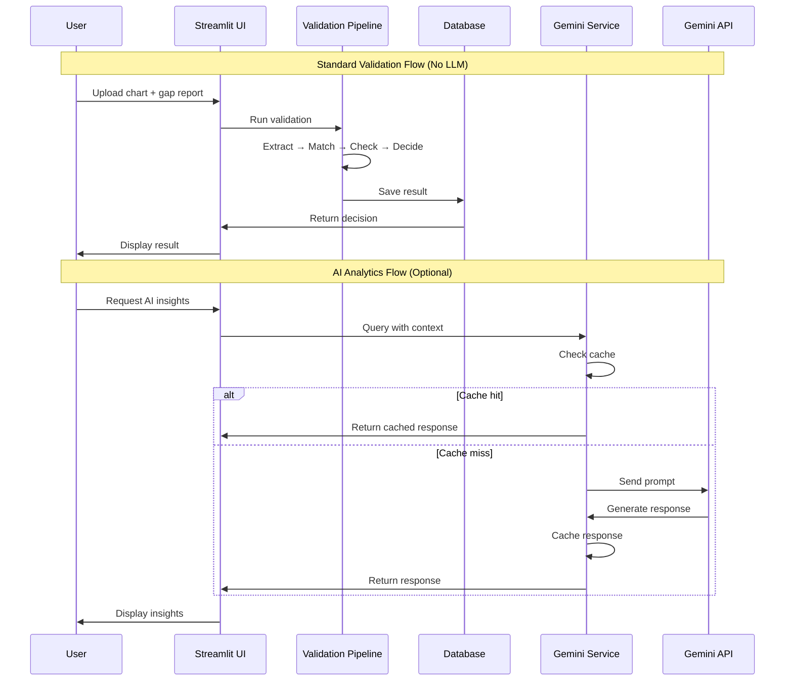
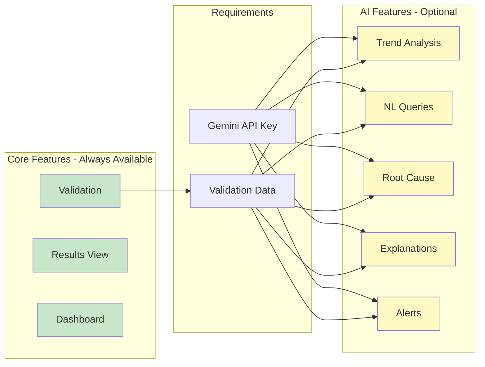
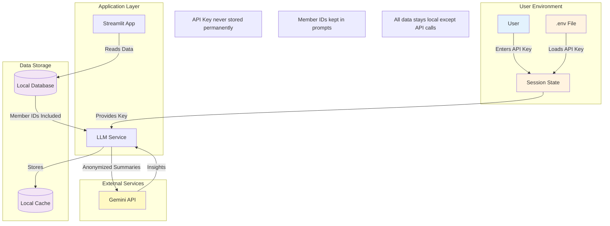
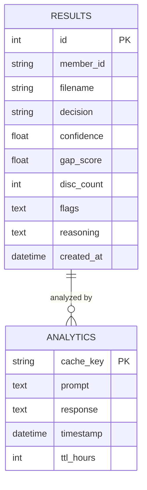
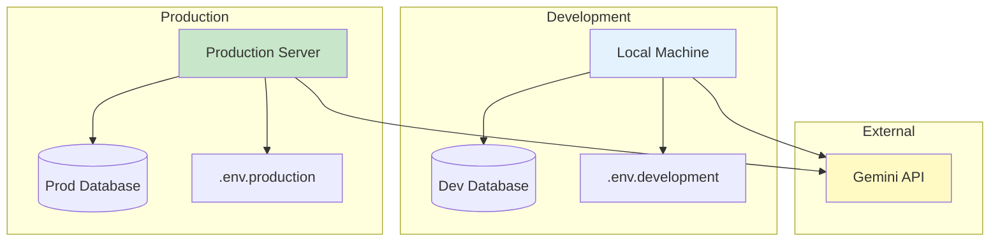
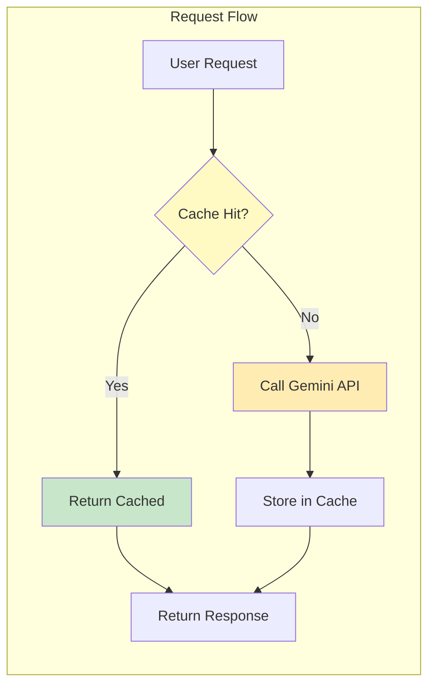
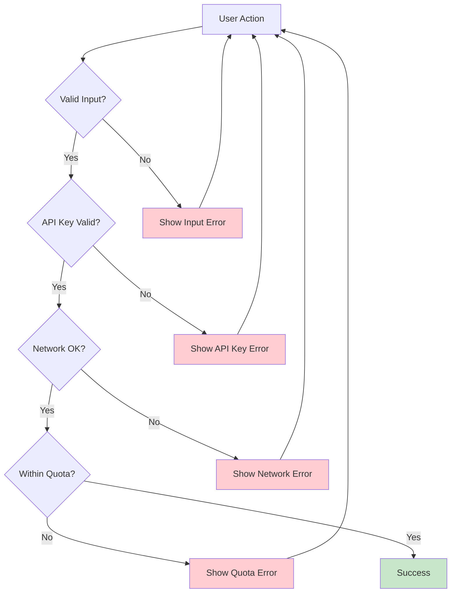
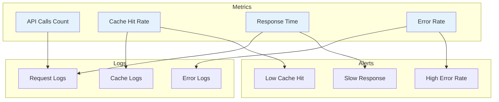

# System Architecture: Medical Chart Validation with Gemini Analytics

## 🏗️ High-Level Architecture

---

## 🔄 Data Flow Diagram

---

## 📊 Component Interaction Matrix

| Component | Reads From | Writes To | Dependencies |
|-----------|------------|-----------|--------------|
| **Extract Agent** | Chart text | - | regex, datetime |
| **Gap Match Agent** | Extracted data, Gap report | - | datetime |
| **Discrepancy Agent** | Extracted data | - | regex, datetime |
| **Decision Agent** | Gap result, Flags | - | - |
| **Database** | - | SQLite file | sqlite3, pandas |
| **LLM Service** | Database, Cache | Cache | google-generativeai |
| **Prompt Templates** | - | - | - |
| **Streamlit UI** | All components | Database | streamlit |

---

## 🎯 Feature Dependency Map

---

## 🔐 Security & Privacy Architecture

---

## 💾 Database Schema

---

## 🚀 Deployment Architecture

---

## 📈 Performance Optimization Strategy

**Cache Strategy:**
- TTL: 24 hours
- Key: MD5 hash of prompt
- Storage: In-memory dictionary
- Invalidation: Automatic on expiry

**Expected Performance:**
- First call: 2-5 seconds
- Cached call: <100ms
- Cache hit rate: >80%

---

## 🔄 Error Handling Flow

---

## 📊 Monitoring & Observability

---

## 🎯 Key Architectural Principles

### 1. **Separation of Concerns**
- Core validation logic is completely independent
- AI layer is a separate, optional module
- Clear boundaries between components

### 2. **Non-Invasive Design**
- AI never modifies validation decisions
- AI features can be disabled without affecting core functionality
- All AI interactions are clearly labeled

### 3. **Performance First**
- Aggressive caching reduces API calls
- Async operations where possible
- Minimal impact on core validation speed

### 4. **Security by Design**
- API keys never stored permanently
- Data stays local except for API calls
- Clear privacy boundaries

### 5. **Fail-Safe Operation**
- Core system works without AI
- Graceful degradation on API failures
- Clear error messages for users

---

## 📝 Implementation Phases

### Phase 1: Foundation ✅
- Set up Gemini SDK
- Create LLM service module
- Implement caching
- Extend database functions

### Phase 2: Core Features ⏳
- Trend analysis
- Natural language queries
- Root cause analysis
- Decision explanations
- Automated alerts

### Phase 3: UI Integration ⏳
- Add Tab 4
- Integrate with existing tabs
- Add API key management
- Polish user experience

### Phase 4: Testing & Docs ⏳
- Comprehensive testing
- User documentation
- Performance optimization
- Security review

---

**This architecture ensures:**
- ✅ Core validation remains deterministic and reliable
- ✅ AI features enhance without interfering
- ✅ System is maintainable and extensible
- ✅ Performance is optimized through caching
- ✅ Security and privacy are maintained