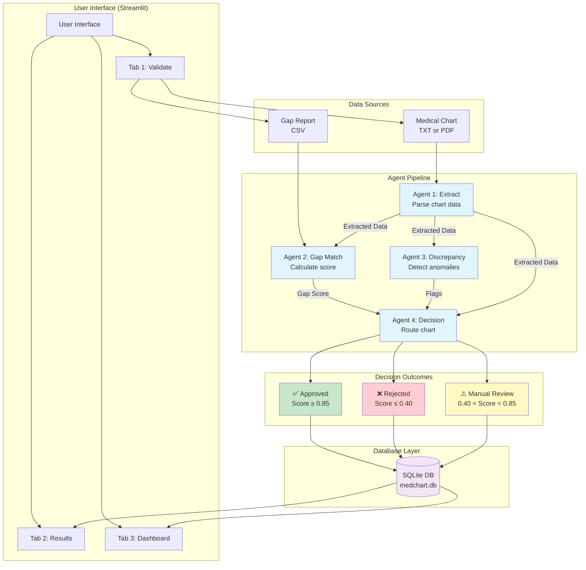
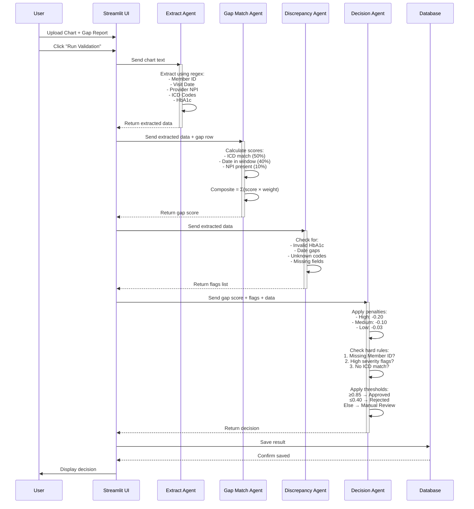
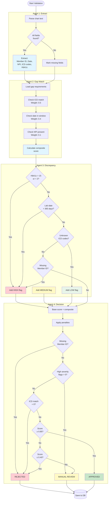
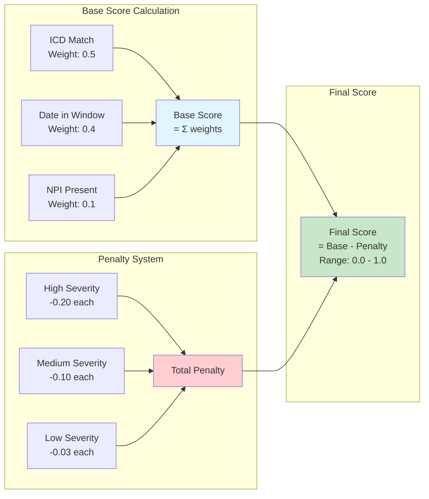
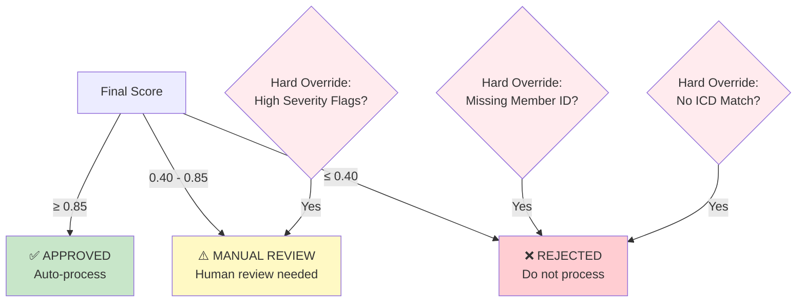
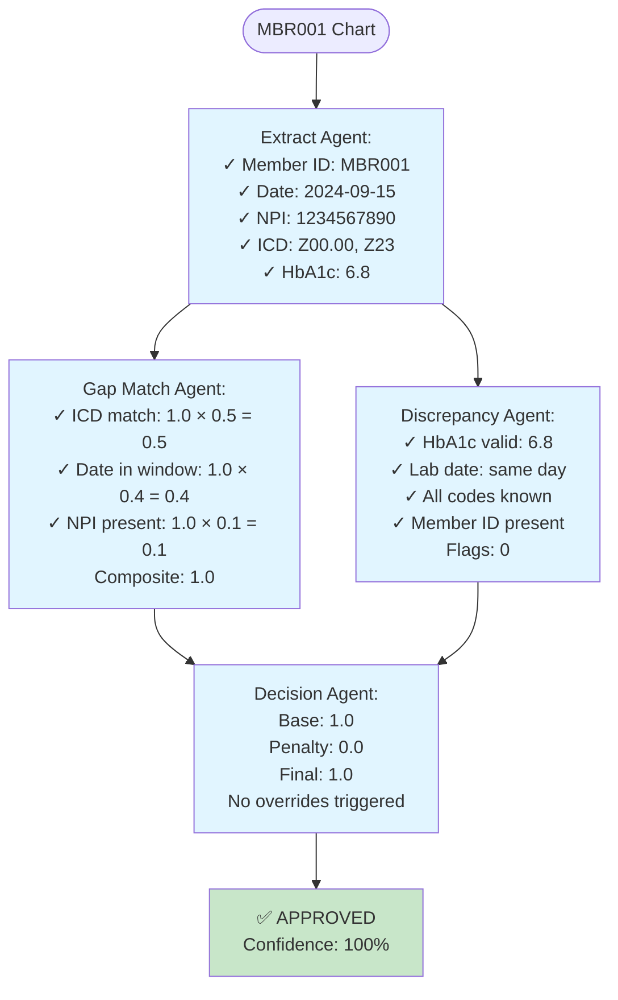
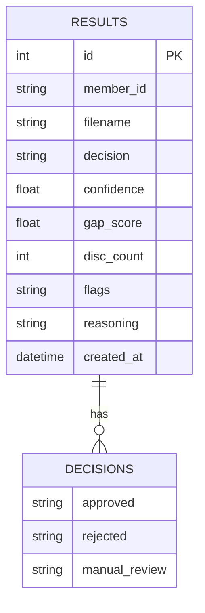

# Medical Chart Validation System - Flow Diagram

## System Architecture

## Detailed Validation Flow

## Agent Logic Details

## Scoring System

## Decision Thresholds

## Example: MBR001 Validation Flow

## Database Schema

## Key Features

### ✅ Zero-LLM Design
- All decisions made by deterministic algorithms
- No AI/ML models involved
- 100% explainable and auditable

### 🎯 4-Agent Pipeline
1. **Extract Agent**: Regex-based data extraction
2. **Gap Match Agent**: Weighted scoring system
3. **Discrepancy Agent**: Rule-based anomaly detection
4. **Decision Agent**: Threshold-based routing with overrides

### 📊 Scoring Weights
- ICD Code Match: 50%
- Date in Window: 40%
- Provider NPI: 10%

### 🚨 Severity Levels
- **High**: -0.20 penalty (triggers manual review)
- **Medium**: -0.10 penalty
- **Low**: -0.03 penalty

### 🎚️ Decision Thresholds
- **Approved**: Score ≥ 0.85
- **Manual Review**: 0.40 < Score < 0.85
- **Rejected**: Score ≤ 0.40

### 🔒 Hard Override Rules (Priority Order)
1. Missing Member ID → REJECTED
2. High Severity Flags → MANUAL REVIEW
3. No ICD Match → REJECTED