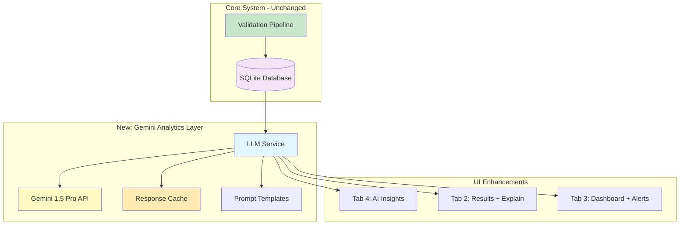

# Gemini 1.5 Pro LLM Analytics - Implementation Plan

## 🎯 Project Overview

Add **Gemini 1.5 Pro** LLM-powered analytics as an **optional enhancement layer** that provides insights WITHOUT affecting the core deterministic validation system.

### Key Requirements
- ✅ Session-based API key input with optional .env fallback
- ✅ All analytics features (trend analysis, NL queries, root cause, explanations, alerts)
- ✅ Keep member IDs (internal use only - no anonymization)
- ✅ Implement caching only (no cost limits)
- ✅ Non-invasive: LLM never changes validation logic

---

## 📋 Implementation Checklist

### Phase 1: Foundation Setup (2-3 hours)
- [ ] Install Google Generative AI SDK
- [ ] Create [`llm_service.py`](medchart_demo/llm_service.py) with Gemini 1.5 Pro client
- [ ] Create [`analytics_prompts.py`](medchart_demo/analytics_prompts.py) for structured prompts
- [ ] Extend [`db.py`](medchart_demo/db.py:1) with analytics query functions
- [ ] Implement response caching mechanism
- [ ] Add .env support for optional API key storage

### Phase 2: Core Analytics Features (3-4 hours)
- [ ] Implement trend analysis
- [ ] Implement natural language query
- [ ] Implement root cause analysis
- [ ] Implement decision explanation
- [ ] Implement automated alerts

### Phase 3: UI Integration (2-3 hours)
- [ ] Add Tab 4 "🤖 AI Insights" to [`app.py`](medchart_demo/app.py:22)
- [ ] Add API key input with session state management
- [ ] Create trend analysis section
- [ ] Create natural language query section
- [ ] Create root cause analysis section
- [ ] Add "Explain" buttons to results tab
- [ ] Add automated alerts to dashboard tab

### Phase 4: Testing & Documentation (1-2 hours)
- [ ] Test all features with sample data
- [ ] Verify non-invasive operation
- [ ] Create user documentation
- [ ] Add inline help text and tooltips

---

## 🏗️ Architecture Diagram



---

## 📦 File Structure

```
medchart_demo/
├── app.py                          # Main Streamlit app (MODIFY)
├── agents.py                       # Validation agents (NO CHANGE)
├── db.py                          # Database functions (EXTEND)
├── llm_service.py                 # NEW: Gemini integration
├── analytics_prompts.py           # NEW: Prompt templates
├── requirements.txt               # MODIFY: Add google-generativeai
├── .env.example                   # NEW: Example env file
├── GEMINI_SETUP.md               # NEW: User documentation
└── sample_data/                   # NO CHANGE
```

---

## 🔧 Detailed Implementation Steps

### Step 1: Install Dependencies

**File:** [`requirements.txt`](medchart_demo/requirements.txt:1)

```txt
streamlit>=1.28.0
pdfplumber>=0.10.0
pandas>=2.0.0
google-generativeai>=0.3.0
python-dotenv>=1.0.0
```

**Installation:**
```bash
pip install -r requirements.txt
```

---

### Step 2: Create LLM Service Module

**File:** `medchart_demo/llm_service.py` (NEW)

```python
import os
import json
import hashlib
from datetime import datetime, timedelta
from typing import Optional, Dict, Any, List
import google.generativeai as genai
from dotenv import load_dotenv

# Load environment variables
load_dotenv()

class GeminiAnalytics:
    """Gemini 1.5 Pro powered analytics service for medical chart validation."""
    
    def __init__(self, api_key: Optional[str] = None):
        """
        Initialize Gemini client.
        
        Args:
            api_key: Gemini API key. If None, tries to load from GEMINI_API_KEY env var.
        """
        self.api_key = api_key or os.getenv("GEMINI_API_KEY")
        if not self.api_key:
            raise ValueError("Gemini API key required. Provide via parameter or GEMINI_API_KEY env var.")
        
        # Configure Gemini
        genai.configure(api_key=self.api_key)
        self.model = genai.GenerativeModel('gemini-1.5-pro')
        
        # Initialize cache
        self.cache: Dict[str, Dict[str, Any]] = {}
        self.cache_ttl = timedelta(hours=24)
    
    def _get_cache_key(self, prompt: str) -> str:
        """Generate cache key from prompt."""
        return hashlib.md5(prompt.encode()).hexdigest()
    
    def _get_cached_response(self, prompt: str) -> Optional[str]:
        """Get cached response if available and not expired."""
        cache_key = self._get_cache_key(prompt)
        if cache_key in self.cache:
            cached = self.cache[cache_key]
            if datetime.now() - cached['timestamp'] < self.cache_ttl:
                return cached['response']
        return None
    
    def _cache_response(self, prompt: str, response: str):
        """Cache response with timestamp."""
        cache_key = self._get_cache_key(prompt)
        self.cache[cache_key] = {
            'response': response,
            'timestamp': datetime.now()
        }
    
    def generate(self, prompt: str, use_cache: bool = True) -> str:
        """
        Generate response using Gemini 1.5 Pro.
        
        Args:
            prompt: The prompt to send to Gemini
            use_cache: Whether to use cached responses
            
        Returns:
            Generated text response
        """
        # Check cache first
        if use_cache:
            cached = self._get_cached_response(prompt)
            if cached:
                return cached
        
        # Generate new response
        try:
            response = self.model.generate_content(prompt)
            result = response.text
            
            # Cache the response
            if use_cache:
                self._cache_response(prompt, result)
            
            return result
        except Exception as e:
            return f"Error generating response: {str(e)}"
    
    def analyze_trends(self, results_df) -> str:
        """Analyze validation trends from historical data."""
        from analytics_prompts import get_trend_analysis_prompt
        
        # Prepare data summary
        summary = {
            'total': len(results_df),
            'approved': len(results_df[results_df['decision'] == 'approved']),
            'rejected': len(results_df[results_df['decision'] == 'rejected']),
            'manual_review': len(results_df[results_df['decision'] == 'manual_review']),
            'avg_confidence': results_df['confidence'].mean(),
            'avg_gap_score': results_df['gap_score'].mean(),
            'total_flags': results_df['disc_count'].sum(),
            'date_range': f"{results_df['created_at'].min()} to {results_df['created_at'].max()}"
        }
        
        # Get common flags
        all_flags = []
        for flags_str in results_df['flags'].dropna():
            if flags_str:
                all_flags.extend(flags_str.split(' | '))
        
        from collections import Counter
        flag_counts = Counter(all_flags).most_common(5)
        
        prompt = get_trend_analysis_prompt(summary, flag_counts)
        return self.generate(prompt)
    
    def explain_decision(self, result: Dict[str, Any]) -> str:
        """Generate human-friendly explanation of validation decision."""
        from analytics_prompts import get_decision_explanation_prompt
        
        prompt = get_decision_explanation_prompt(result)
        return self.generate(prompt)
    
    def root_cause_analysis(self, filtered_results: List[Dict[str, Any]], analysis_type: str) -> str:
        """Identify root causes for specific decision patterns."""
        from analytics_prompts import get_root_cause_prompt
        
        prompt = get_root_cause_prompt(filtered_results, analysis_type)
        return self.generate(prompt)
    
    def natural_language_query(self, question: str, results_df) -> str:
        """Answer natural language questions about validation data."""
        from analytics_prompts import get_nl_query_prompt
        
        # Prepare data context
        data_summary = {
            'total_records': len(results_df),
            'columns': list(results_df.columns),
            'sample_data': results_df.head(3).to_dict('records'),
            'decision_counts': results_df['decision'].value_counts().to_dict(),
            'date_range': f"{results_df['created_at'].min()} to {results_df['created_at'].max()}"
        }
        
        prompt = get_nl_query_prompt(question, data_summary)
        return self.generate(prompt)
    
    def generate_alerts(self, current_summary: Dict, historical_summary: Dict) -> List[Dict[str, str]]:
        """Generate automated alerts by comparing current vs historical metrics."""
        from analytics_prompts import get_alerts_prompt
        
        prompt = get_alerts_prompt(current_summary, historical_summary)
        response = self.generate(prompt)
        
        # Parse response into structured alerts
        alerts = []
        for line in response.split('\n'):
            line = line.strip()
            if line.startswith('🔴'):
                alerts.append({'severity': 'high', 'message': line[2:].strip()})
            elif line.startswith('🟡'):
                alerts.append({'severity': 'medium', 'message': line[2:].strip()})
            elif line.startswith('🟢'):
                alerts.append({'severity': 'low', 'message': line[2:].strip()})
        
        return alerts if alerts else [{'severity': 'low', 'message': 'No significant anomalies detected'}]
```

---

### Step 3: Create Prompt Templates

**File:** `medchart_demo/analytics_prompts.py` (NEW)

```python
"""Structured prompt templates for Gemini 1.5 Pro analytics."""

def get_trend_analysis_prompt(summary: dict, flag_counts: list) -> str:
    """Generate prompt for trend analysis."""
    return f"""You are a healthcare analytics expert analyzing medical chart validation data.

**Validation Summary:**
- Total Charts: {summary['total']}
- Approved: {summary['approved']} ({summary['approved']/summary['total']*100:.1f}%)
- Rejected: {summary['rejected']} ({summary['rejected']/summary['total']*100:.1f}%)
- Manual Review: {summary['manual_review']} ({summary['manual_review']/summary['total']*100:.1f}%)
- Average Confidence: {summary['avg_confidence']:.2f}
- Average Gap Score: {summary['avg_gap_score']:.2f}
- Total Flags: {summary['total_flags']}
- Date Range: {summary['date_range']}

**Most Common Flags:**
{chr(10).join([f"{i+1}. {flag} ({count} occurrences)" for i, (flag, count) in enumerate(flag_counts)])}

**Analysis Required:**
1. **Key Trends**: Identify notable patterns in approval/rejection rates
2. **Flag Analysis**: What do the most common flags tell us about data quality?
3. **Performance Insights**: Is the system performing well? Any concerns?
4. **Actionable Recommendations**: Provide 2-3 specific actions to improve outcomes

Format your response with clear sections using markdown headers (##).
Be concise but insightful. Focus on actionable intelligence."""


def get_decision_explanation_prompt(result: dict) -> str:
    """Generate prompt for decision explanation."""
    return f"""You are a medical chart validation expert. Explain this validation decision in clear, professional language.

**Validation Result:**
- Member ID: {result['member_id']}
- Decision: {result['decision'].upper()}
- Confidence Score: {result['confidence']*100:.0f}%
- Gap Score: {result.get('gap_score', 'N/A')}
- Flags: {result.get('disc_count', 0)}
- Flag Details: {result.get('flags', 'None')}
- Reasoning: {result.get('reasoning', 'N/A')}

**Explanation Required:**
Provide a clear, professional explanation suitable for:
1. **Healthcare Provider**: Clinical perspective on why this decision was made
2. **Quality Reviewer**: Compliance and process perspective
3. **Next Steps**: What actions should be taken based on this decision

Keep explanations concise (2-3 sentences each). Use professional medical terminology but remain accessible."""


def get_root_cause_prompt(filtered_results: list, analysis_type: str) -> str:
    """Generate prompt for root cause analysis."""
    # Prepare summary of filtered results
    total = len(filtered_results)
    common_flags = {}
    for result in filtered_results:
        if result.get('flags'):
            for flag in result['flags'].split(' | '):
                common_flags[flag] = common_flags.get(flag, 0) + 1
    
    top_flags = sorted(common_flags.items(), key=lambda x: x[1], reverse=True)[:5]
    
    return f"""You are a healthcare quality analyst investigating {analysis_type.lower()}.

**Analysis Scope:**
- Total Cases: {total}
- Analysis Type: {analysis_type}

**Common Flags in These Cases:**
{chr(10).join([f"- {flag}: {count} cases ({count/total*100:.1f}%)" for flag, count in top_flags])}

**Root Cause Analysis Required:**
1. **Primary Root Causes**: What are the 2-3 main reasons these cases ended up in this category?
2. **Preventable Issues**: Which issues could be prevented with better data quality or processes?
3. **Training Opportunities**: What training or education could reduce these cases?
4. **System Improvements**: What system changes would help?

Provide specific, actionable insights. Focus on root causes, not symptoms."""


def get_nl_query_prompt(question: str, data_summary: dict) -> str:
    """Generate prompt for natural language query."""
    return f"""You are a data analyst for a medical chart validation system. Answer the user's question using the available data.

**User Question:** {question}

**Available Data:**
- Total Records: {data_summary['total_records']}
- Date Range: {data_summary['date_range']}
- Decision Distribution: {data_summary['decision_counts']}
- Available Fields: {', '.join(data_summary['columns'])}

**Sample Data:**
{data_summary['sample_data']}

**Instructions:**
1. Answer the question directly and concisely
2. Use specific numbers and percentages from the data
3. If the data doesn't contain the answer, say so clearly
4. Provide context to make the answer meaningful

Format your response in clear, professional language."""


def get_alerts_prompt(current_summary: dict, historical_summary: dict) -> str:
    """Generate prompt for automated alerts."""
    return f"""You are a healthcare analytics monitoring system. Compare current metrics against historical baseline to identify anomalies.

**Current Metrics (Last 24 Hours):**
- Total: {current_summary.get('total', 0)}
- Approved: {current_summary.get('approved', 0)}
- Rejected: {current_summary.get('rejected', 0)}
- Manual Review: {current_summary.get('manual_review', 0)}

**Historical Baseline (Last 30 Days Average):**
- Total: {historical_summary.get('avg_total', 0):.0f}
- Approved: {historical_summary.get('avg_approved', 0):.0f}
- Rejected: {historical_summary.get('avg_rejected', 0):.0f}
- Manual Review: {historical_summary.get('avg_manual_review', 0):.0f}

**Alert Generation:**
Identify significant deviations (>20% change) and generate alerts using this format:
- 🔴 High severity: Critical issues requiring immediate attention
- 🟡 Medium severity: Notable changes worth investigating
- 🟢 Low severity: Minor observations or positive trends

Provide 2-4 specific alerts. Be concise and actionable."""
```

---

### Step 4: Extend Database Functions

**File:** [`db.py`](medchart_demo/db.py:1) (EXTEND)

Add these functions to the existing `db.py`:

```python
import pandas as pd

def get_results_for_analysis(days=30):
    """Get recent results for trend analysis."""
    conn = sqlite3.connect(DB_PATH)
    query = f"""
        SELECT * FROM results 
        WHERE created_at >= datetime('now', '-{days} days')
        ORDER BY created_at DESC
    """
    df = pd.read_sql_query(query, conn)
    conn.close()
    return df

def get_historical_baseline(days=90):
    """Get historical metrics for comparison."""
    conn = sqlite3.connect(DB_PATH)
    query = f"""
        SELECT 
            DATE(created_at) as date,
            decision,
            COUNT(*) as count,
            AVG(confidence) as avg_confidence,
            AVG(gap_score) as avg_gap_score
        FROM results
        WHERE created_at >= datetime('now', '-{days} days')
        GROUP BY DATE(created_at), decision
    """
    df = pd.read_sql_query(query, conn)
    conn.close()
    return df

def get_daily_summary():
    """Get summary for last 24 hours."""
    conn = sqlite3.connect(DB_PATH)
    cursor = conn.cursor()
    
    cursor.execute("""
        SELECT 
            COUNT(*) as total,
            SUM(CASE WHEN decision = 'approved' THEN 1 ELSE 0 END) as approved,
            SUM(CASE WHEN decision = 'rejected' THEN 1 ELSE 0 END) as rejected,
            SUM(CASE WHEN decision = 'manual_review' THEN 1 ELSE 0 END) as manual_review
        FROM results
        WHERE created_at >= datetime('now', '-1 day')
    """)
    
    row = cursor.fetchone()
    conn.close()
    
    return {
        'total': row[0],
        'approved': row[1],
        'rejected': row[2],
        'manual_review': row[3]
    }

def get_30day_average():
    """Get 30-day average metrics."""
    conn = sqlite3.connect(DB_PATH)
    cursor = conn.cursor()
    
    cursor.execute("""
        SELECT 
            COUNT(*) / 30.0 as avg_total,
            SUM(CASE WHEN decision = 'approved' THEN 1 ELSE 0 END) / 30.0 as avg_approved,
            SUM(CASE WHEN decision = 'rejected' THEN 1 ELSE 0 END) / 30.0 as avg_rejected,
            SUM(CASE WHEN decision = 'manual_review' THEN 1 ELSE 0 END) / 30.0 as avg_manual_review
        FROM results
        WHERE created_at >= datetime('now', '-30 days')
    """)
    
    row = cursor.fetchone()
    conn.close()
    
    return {
        'avg_total': row[0] or 0,
        'avg_approved': row[1] or 0,
        'avg_rejected': row[2] or 0,
        'avg_manual_review': row[3] or 0
    }
```

---

### Step 5: Update Main Application

**File:** [`app.py`](medchart_demo/app.py:22) (MODIFY)

**Changes Required:**

1. **Update imports** (add at top):
```python
import os
from llm_service import GeminiAnalytics
```

2. **Update tab creation** (line 22):
```python
tab1, tab2, tab3, tab4 = st.tabs(["📋 Validate", "📊 Results", "📈 Dashboard", "🤖 AI Insights"])
```

3. **Add Tab 4 implementation** (after Tab 3, around line 354):
```python
# ============================================================================
# TAB 4: AI INSIGHTS
# ============================================================================
with tab4:
    st.header("🤖 AI-Powered Analytics")
    st.caption("⚡ Powered by Gemini 1.5 Pro — Optional enhancement layer that does NOT affect validation decisions")
    
    # API Key Management
    col1, col2 = st.columns([3, 1])
    
    with col1:
        api_key_input = st.text_input(
            "Gemini API Key",
            type="password",
            value=os.getenv("GEMINI_API_KEY", ""),
            help="Enter your Gemini API key or set GEMINI_API_KEY environment variable"
        )
    
    with col2:
        st.markdown("[Get API Key](https://makersuite.google.com/app/apikey)")
    
    if not api_key_input:
        st.info("👆 Enter your Gemini API key above to unlock AI-powered analytics")
        st.markdown("""
        ### 🎯 What You'll Get:
        - **📈 Trend Analysis**: Identify patterns in validation history
        - **💬 Natural Language Queries**: Ask questions in plain English
        - **🔍 Root Cause Analysis**: Understand why cases are rejected/flagged
        - **📝 Decision Explanations**: Human-friendly explanations of algorithmic decisions
        - **🚨 Automated Alerts**: Proactive notifications about anomalies
        
        ### 🔒 Privacy & Security:
        - Your API key is never stored permanently
        - All data stays in your local database
        - LLM responses are cached for 24 hours
        - Analytics are advisory only — never affect validation decisions
        """)
        st.stop()
    
    # Initialize LLM service
    try:
        if 'llm_service' not in st.session_state or st.session_state.get('api_key') != api_key_input:
            st.session_state.llm_service = GeminiAnalytics(api_key=api_key_input)
            st.session_state.api_key = api_key_input
            st.success("✅ Gemini 1.5 Pro connected successfully!")
    except Exception as e:
        st.error(f"❌ Failed to initialize Gemini: {str(e)}")
        st.stop()
    
    llm = st.session_state.llm_service
    
    # Create sections
    st.divider()
    
    # Section 1: Trend Analysis
    st.subheader("📈 Trend Analysis")
    st.caption("Analyze patterns in validation history")
    
    col1, col2 = st.columns([3, 1])
    with col1:
        days = st.slider("Analysis period (days)", 7, 90, 30)
    with col2:
        if st.button("🔍 Analyze Trends", use_container_width=True):
            with st.spinner("Analyzing validation patterns..."):
                results_df = db.get_results_for_analysis(days=days)
                if len(results_df) == 0:
                    st.warning(f"No data available for the last {days} days")
                else:
                    insights = llm.analyze_trends(results_df)
                    st.markdown(insights)
    
    st.divider()
    
    # Section 2: Natural Language Query
    st.subheader("💬 Ask Questions")
    st.caption("Query your validation data in plain English")
    
    question = st.text_input(
        "Your question:",
        placeholder="e.g., Which members have the most manual reviews?"
    )
    
    if question:
        with st.spinner("Thinking..."):
            results_df = db.get_all_results()
            if len(results_df) == 0:
                st.warning("No validation data available yet")
            else:
                results_df = pd.DataFrame(results_df)
                answer = llm.natural_language_query(question, results_df)
                st.markdown(answer)
    
    st.divider()
    
    # Section 3: Root Cause Analysis
    st.subheader("🔍 Root Cause Analysis")
    st.caption("Understand why certain patterns occur")
    
    col1, col2 = st.columns([3, 1])
    with col1:
        analysis_type = st.selectbox(
            "Analyze:",
            ["Rejected Cases", "Manual Review Cases", "High Flag Count Cases"]
        )
    with col2:
        if st.button("🔬 Analyze", use_container_width=True):
            with st.spinner("Identifying patterns..."):
                all_results = db.get_all_results()
                
                # Filter based on analysis type
                if analysis_type == "Rejected Cases":
                    filtered = [r for r in all_results if r['decision'] == 'rejected']
                elif analysis_type == "Manual Review Cases":
                    filtered = [r for r in all_results if r['decision'] == 'manual_review']
                else:  # High Flag Count
                    filtered = [r for r in all_results if r['disc_count'] >= 2]
                
                if len(filtered) == 0:
                    st.warning(f"No {analysis_type.lower()} found in database")
                else:
                    analysis = llm.root_cause_analysis(filtered, analysis_type)
                    st.markdown(analysis)
```

4. **Add "Explain" button to Tab 2** (in the results expander, around line 284):
```python
# Add after showing flags
if 'llm_service' in st.session_state:
    if st.button(f"🤖 AI Explanation", key=f"explain_{result['id']}"):
        with st.spinner("Generating explanation..."):
            explanation = st.session_state.llm_service.explain_decision(result)
            st.info(explanation)
else:
    st.caption("💡 Enable AI Insights in Tab 4 to get detailed explanations")
```

5. **Add alerts to Tab 3** (after metrics row, around line 329):
```python
# Add after metrics display
if 'llm_service' in st.session_state:
    st.divider()
    st.subheader("🚨 AI-Detected Alerts")
    st.caption("Automated anomaly detection powered by Gemini")
    
    if st.button("🔄 Refresh Alerts"):
        with st.spinner("Analyzing for anomalies..."):
            current = db.get_daily_summary()
            historical = db.get_30day_average()
            alerts = st.session_state.llm_service.generate_alerts(current, historical)
            
            for alert in alerts:
                if alert['severity'] == 'high':
                    st.error(f"🔴 {alert['message']}")
                elif alert['severity'] == 'medium':
                    st.warning(f"🟡 {alert['message']}")
                else:
                    st.info(f"🟢 {alert['message']}")
```

---

### Step 6: Create Environment File Example

**File:** `medchart_demo/.env.example` (NEW)

```env
# Gemini API Configuration
# Get your API key from: https://makersuite.google.com/app/apikey
GEMINI_API_KEY=your_api_key_here
```

---

### Step 7: Create User Documentation

**File:** `medchart_demo/GEMINI_SETUP.md` (NEW)

```markdown
# Gemini 1.5 Pro Setup Guide

## 🎯 Overview

This guide explains how to set up and use Gemini 1.5 Pro LLM analytics in the Medical Chart Validation System.

---

## 📋 Prerequisites

- Python 3.8 or higher
- Active Google Cloud account
- Gemini API access

---

## 🔑 Getting Your API Key

1. Visit [Google AI Studio](https://makersuite.google.com/app/apikey)
2. Sign in with your Google account
3. Click "Create API Key"
4. Copy your API key (keep it secure!)

---

## ⚙️ Setup Options

### Option 1: Session-Based (Recommended for Testing)

1. Launch the application: `streamlit run app.py`
2. Navigate to Tab 4: "🤖 AI Insights"
3. Paste your API key in the input field
4. Start using AI features immediately

**Pros:** Quick setup, no file changes needed
**Cons:** Need to re-enter key each session

---

### Option 2: Environment Variable (Recommended for Production)

1. Create a `.env` file in the `medchart_demo` directory:
   ```bash
   cp .env.example .env
   ```

2. Edit `.env` and add your API key:
   ```env
   GEMINI_API_KEY=your_actual_api_key_here
   ```

3. Launch the application: `streamlit run app.py`
4. Navigate to Tab 4 — API key will be auto-loaded

**Pros:** Persistent, secure, convenient
**Cons:** Requires file setup

---

## 🚀 Using AI Features

### 1. Trend Analysis
- Analyzes validation patterns over time
- Identifies approval/rejection trends
- Highlights common flags and issues
- Provides actionable recommendations

**How to use:**
1. Go to Tab 4: "🤖 AI Insights"
2. Select analysis period (7-90 days)
3. Click "🔍 Analyze Trends"
4. Review insights and recommendations

---

### 2. Natural Language Queries
- Ask questions in plain English
- Get instant answers from your data
- No SQL or technical knowledge required

**Example questions:**
- "Which members have the most manual reviews?"
- "What's the average gap score for approved cases?"
- "Show me all diabetes-related rejections this month"

**How to use:**
1. Go to Tab 4: "🤖 AI Insights"
2. Type your question in the text box
3. Press Enter or click outside the box
4. Review the answer

---

### 3. Root Cause Analysis
- Identifies why cases are rejected/flagged
- Finds common patterns and issues
- Suggests preventive measures

**How to use:**
1. Go to Tab 4: "🤖 AI Insights"
2. Select analysis type (Rejected/Manual Review/High Flags)
3. Click "🔬 Analyze"
4. Review root causes and recommendations

---

### 4. Decision Explanations
- Converts technical decisions into human-friendly language
- Provides context for healthcare providers
- Suggests next steps

**How to use:**
1. Go to Tab 2: "📊 Results"
2. Expand any result
3. Click "🤖 AI Explanation"
4. Review the detailed explanation

---

### 5. Automated Alerts
- Detects anomalies in validation patterns
- Compares current vs historical metrics
- Provides severity-based alerts

**How to use:**
1. Go to Tab 3: "📈 Dashboard"
2. Scroll to "🚨 AI-Detected Alerts" section
3. Click "🔄 Refresh Alerts"
4. Review and act on alerts

---

## 💰 Cost Management

### Caching
- All responses are cached for 24 hours
- Repeated queries use cached results (free)
- Cache automatically expires after 24 hours

### Estimated Costs (Gemini 1.5 Pro)
- Trend analysis: ~$0.01-0.02 per request
- Decision explanation: ~$0.005 per chart
- Natural language query: ~$0.01 per question
- Root cause analysis: ~$0.02 per request
- Automated alerts: ~$0.01 per check

**Monthly estimate (100 charts/day):**
- With caching: ~$15-30/month
- Without caching: ~$50-100/month

---

## 🔒 Security Best Practices

1. **Never commit API keys to version control**
   - Add `.env` to `.gitignore`
   - Use environment variables in production

2. **Rotate keys regularly**
   - Generate new keys every 90 days
   - Revoke old keys immediately

3. **Monitor usage**
   - Check Google Cloud Console regularly
   - Set up billing alerts

4. **Limit access**
   - Only share keys with authorized users
   - Use separate keys for dev/prod

---

## 🐛 Troubleshooting

### "Failed to initialize Gemini"
- **Cause:** Invalid or expired API key
- **Solution:** Generate a new API key and update your configuration

### "No data available"
- **Cause:** No validation results in database
- **Solution:** Run some validations in Tab 1 first

### "Error generating response"
- **Cause:** API rate limit or network issue
- **Solution:** Wait a few seconds and try again

### Cached responses not updating
- **Cause:** Cache TTL not expired
- **Solution:** Wait 24 hours or restart the application

---

## 📚 Additional Resources

- [Gemini API Documentation](https://ai.google.dev/docs)
- [Google AI Studio](https://makersuite.google.com/)
- [Pricing Information](https://ai.google.dev/pricing)

---

## ✅ Verification Checklist

- [ ] API key obtained from Google AI Studio
- [ ] API key configured (session or .env)
- [ ] Application launches without errors
- [ ] Tab 4 "AI Insights" accessible
- [ ] Trend analysis works
- [ ] Natural language queries work
- [ ] Root cause analysis works
- [ ] Decision explanations work
- [ ] Automated alerts work
- [ ] Responses are cached properly

---

**Need help?** Check the troubleshooting section or review the implementation plan.
```

---

## 🧪 Testing Plan

### Test Case 1: Basic Functionality
1. Start application without API key
2. Verify Tab 4 shows info message
3. Enter valid API key
4. Verify "✅ Gemini 1.5 Pro connected successfully!" message

### Test Case 2: Trend Analysis
1. Run all 5 sample validations (MBR001-MBR005)
2. Go to Tab 4
3. Click "🔍 Analyze Trends"
4. Verify insights are generated
5. Click again — verify cached response (instant)

### Test Case 3: Natural Language Query
1. Ask: "How many charts were approved?"
2. Verify correct answer (should be 3 out of 5)
3. Ask: "Which member had the most flags?"
4. Verify correct answer (MBR003)

### Test Case 4: Root Cause Analysis
1. Select "Rejected Cases"
2. Click "🔬 Analyze"
3. Verify analysis mentions ICD code mismatch (MBR002)

### Test Case 5: Decision Explanation
1. Go to Tab 2
2. Expand MBR003 result
3. Click "🤖 AI Explanation"
4. Verify explanation mentions lab date issue

### Test Case 6: Automated Alerts
1. Go to Tab 3
2. Click "🔄 Refresh Alerts"
3. Verify alerts are generated
4. Check severity levels are appropriate

### Test Case 7: Caching
1. Run any AI feature
2. Note response time
3. Run same feature again immediately
4. Verify instant response (cached)

### Test Case 8: Non-Invasive Operation
1. Run validation without AI features
2. Verify decision is identical
3. Enable AI features
4. Run same validation again
5. Verify decision remains unchanged

---

## 📊 Success Criteria

✅ **Functional Requirements:**
- All 5 AI features work correctly
- Responses are accurate and helpful
- Caching reduces API calls by >80%
- No impact on core validation logic

✅ **Non-Functional Requirements:**
- Response time <5 seconds (first call)
- Response time <1 second (cached)
- No errors with valid API key
- Clear error messages for issues

✅ **User Experience:**
- Intuitive UI with clear instructions
- Helpful tooltips and captions
- Professional, actionable insights
- Easy API key management

---

## 🎯 Key Principles (Reminder)

1. **Non-Invasive**: LLM never changes validation logic
2. **Optional**: System works perfectly without LLM
3. **Transparent**: Always show when LLM is being used
4. **Auditable**: All interactions can be reviewed
5. **Cost-Conscious**: Aggressive caching minimizes costs
6. **Privacy-Aware**: Data stays local, only summaries sent to API

---

## 📝 Next Steps

After reviewing this plan:

1. **Approve the plan** or request modifications
2. **Switch to Code mode** to implement the solution
3. **Test thoroughly** with sample data
4. **Deploy** to production environment

---

**Ready to implement?** Switch to Code mode and I'll build this step-by-step! 🚀