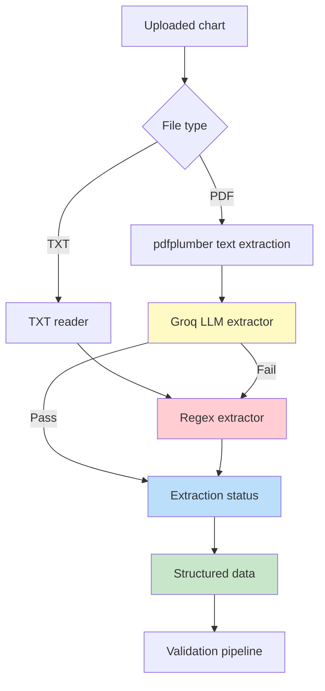
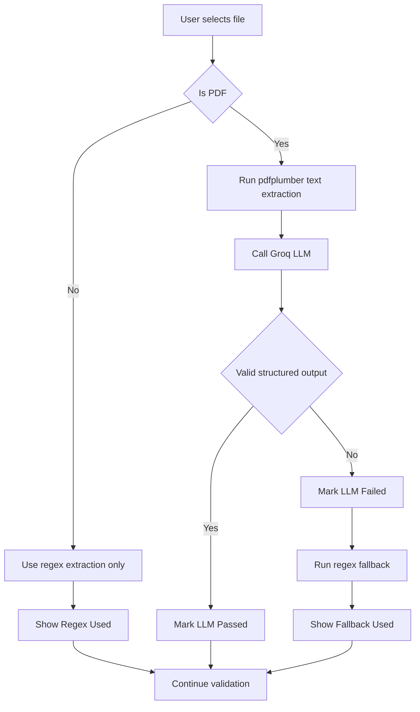

# 📄 Groq-Based PDF Extraction Plan

## 🎯 Overview

This document outlines the plan to enhance the Medical Chart Validation System with **PDF-only intelligent extraction** using Groq's LLM API instead of relying only on the current rule-based `pdfplumber` plus regex approach.

The revised scope is intentionally narrow:

- Groq LLM extraction is used **only when the selected file is a PDF**
- TXT files continue to use the existing regex-based extraction flow
- The UI must clearly show whether the **LLM passed** or **LLM failed and fallback was used**

---

## 🔍 Current vs Proposed Approach

### Current Approach
```
TXT/PDF → pdfplumber or plain text read → Regex Extract Agent → Structured Data
```

**Limitations:**
- ❌ PDF extraction is plain-text only and loses semantic meaning
- ❌ Regex extraction is rigid and sensitive to label variations
- ❌ Users cannot tell whether AI extraction succeeded or fallback was used
- ❌ No explicit pass/fail visibility for LLM-assisted extraction
- ❌ PDF handling does not distinguish between LLM success and regex fallback

### Proposed Approach
```
TXT  → Plain Text Read → Regex Extract Agent → Structured Data

PDF  → pdfplumber → Plain Text → Groq LLM Extractor
                                 ↓
                        if LLM fails or output invalid
                                 ↓
                         Regex Fallback Extractor
                                 ↓
                           Structured Data
```

**Advantages:**
- ✅ Groq is applied only where it adds value most: PDF parsing
- ✅ TXT behavior remains simple and predictable
- ✅ Clear pass/fail status for LLM extraction
- ✅ Safe fallback preserves non-breaking behavior
- ✅ Better PDF extraction accuracy on complex layouts
- ✅ Easier troubleshooting for demo users

---

## 🏗️ Architecture Design

### System Flow Diagram



### Decision Logic



### Component Architecture

```
┌─────────────────────────────────────────────────────────┐
│                   Chart Input Layer                     │
│  - Upload TXT or PDF                                   │
│  - Sample chart selection                              │
└──────────────────┬──────────────────────────────────────┘
                   │
                   ↓
┌─────────────────────────────────────────────────────────┐
│                File Type Router                         │
│  - Detect .pdf vs .txt                                 │
│  - Enable Groq path only for PDF                       │
└───────────────┬───────────────────────┬─────────────────┘
                │                       │
                │ TXT                   │ PDF
                ↓                       ↓
┌──────────────────────────────┐   ┌──────────────────────┐
│ Regex Extractor              │   │ pdfplumber           │
│ - Current rule-based logic   │   │ - Convert PDF to text│
└───────────────┬──────────────┘   └──────────┬───────────┘
                │                              │
                │                              ↓
                │                     ┌──────────────────────┐
                │                     │ Groq LLM Extractor   │
                │                     │ - Primary path for   │
                │                     │   PDF only           │
                │                     └──────────┬───────────┘
                │                                │
                │                     pass       │ fail
                │                                ↓
                │                     ┌──────────────────────┐
                │                     │ Regex Fallback       │
                │                     │ - Existing parser    │
                │                     └──────────┬───────────┘
                └──────────────────────┬─────────┘
                                       ↓
┌─────────────────────────────────────────────────────────┐
│              Extraction Status Output                   │
│  - method_requested                                     │
│  - method_used                                          │
│  - llm_attempted                                        │
│  - llm_status: passed or failed                         │
│  - fallback_used                                        │
│  - llm_error if any                                     │
└──────────────────┬──────────────────────────────────────┘
                   ↓
┌─────────────────────────────────────────────────────────┐
│           Existing Validation Pipeline                  │
│  Gap Match → Discrepancy → Decision                    │
└─────────────────────────────────────────────────────────┘
```

---

## 💻 Revised Implementation Plan

### Phase 1: Create Groq PDF Extractor Module

#### File: `medchart_demo/groq_extractor.py`

This module remains focused on intelligent extraction from PDF-derived text, but the plan now explicitly treats it as a **PDF-only extractor**.

```python
"""
Groq-based intelligent PDF extraction module.
Used only for PDF inputs after pdfplumber text extraction.
"""

import os
import json
from typing import Dict, Any, Optional
from groq import Groq
from datetime import datetime

class GroqPDFExtractor:
    """
    Intelligent PDF extractor using Groq's LLM API.
    Invoked only for PDF uploads.
    """

    def __init__(self, api_key: Optional[str] = None):
        self.client = Groq(api_key=api_key or os.getenv("GROQ_API_KEY"))
        self.model = "llama-3.3-70b-versatile"
        self.cache = {}

    def extract_from_text(self, chart_text: str) -> Dict[str, Any]:
        """
        Extract structured medical data from PDF text using Groq LLM.
        Raises on invalid JSON or API failure so caller can mark LLM failed
        and switch to regex fallback.
        """
        ...
```

### Phase 2: Update Extract Agent with PDF-only Groq Routing

#### File: `medchart_demo/agents.py`

The extract agent should be extended to support:

- file-type aware routing
- PDF-only Groq execution
- structured metadata about LLM pass or fail
- regex fallback when Groq fails

#### Proposed interface

```python
def run_extract_agent(
    text: str,
    file_type: str = "txt",
    use_groq_for_pdf: bool = True,
    api_key: Optional[str] = None
) -> Dict[str, Any]:
    ...
```

#### Proposed behavior

- If `file_type` is `txt`
  - do not call Groq
  - use regex extraction directly
  - mark `llm_attempted = False`
  - mark `llm_status = "not_applicable"`

- If `file_type` is `pdf` and Groq is enabled
  - call Groq extractor first
  - if extraction succeeds and output validates
    - mark `llm_attempted = True`
    - mark `llm_status = "passed"`
    - mark `fallback_used = False`
    - mark `method_used = "groq_pdf"`
  - if extraction fails
    - mark `llm_attempted = True`
    - mark `llm_status = "failed"`
    - capture `llm_error`
    - run regex fallback
    - mark `fallback_used = True`
    - mark `method_used = "regex_fallback"`

- If `file_type` is `pdf` but Groq is not enabled or API key is unavailable
  - use regex extraction
  - mark `llm_attempted = False`
  - mark `llm_status = "skipped"`
  - mark `method_used = "regex_pdf"`

#### Planned extraction metadata contract

The returned extraction result should include both extracted fields and metadata:

```json
{
  "member_id": "MBR001",
  "visit_date": "2024-01-15",
  "npi": "1234567890",
  "icd_codes": ["E11.9"],
  "raw_text": "...",
  "_extraction_meta": {
    "file_type": "pdf",
    "method_requested": "groq_pdf",
    "method_used": "groq_pdf",
    "llm_attempted": true,
    "llm_status": "passed",
    "fallback_used": false,
    "llm_error": null
  }
}
```

Fallback example:

```json
{
  "_extraction_meta": {
    "file_type": "pdf",
    "method_requested": "groq_pdf",
    "method_used": "regex_fallback",
    "llm_attempted": true,
    "llm_status": "failed",
    "fallback_used": true,
    "llm_error": "Failed to parse LLM response as JSON"
  }
}
```

### Phase 3: Update Streamlit UI for PDF-only Groq Behavior

#### File: `medchart_demo/app.py`

The UI plan changes significantly from the earlier generic method selector.

### Revised UI rules

- If user uploads a TXT file
  - do not show Groq extraction option
  - display that TXT uses regex extraction
- If user uploads a PDF file
  - show Groq option for PDF processing
  - allow Groq API key entry
  - show extraction status after execution
- If user uses sample TXT charts
  - continue regex extraction only
  - no LLM status should be shown as pass or fail
  - status should indicate not applicable or not attempted

### Proposed UI behavior in Tab 1

#### For TXT files
```python
st.info("TXT files use rule-based extraction.")
```

#### For PDF files
```python
st.info("PDF files can use Groq AI-assisted extraction with regex fallback.")
use_groq_for_pdf = st.checkbox("Use Groq for PDF extraction", value=True)
```

#### Status display after extraction

The app should render a visible status block after extraction using `_extraction_meta`.

##### Case 1: PDF and LLM passed
```python
st.success("LLM extraction: PASSED")
st.caption("Method used: Groq PDF extraction")
```

##### Case 2: PDF and LLM failed, fallback used
```python
st.warning("LLM extraction: FAILED")
st.caption("Fallback used: Regex extraction")
st.caption(f"LLM error: {llm_error}")
```

##### Case 3: TXT file
```python
st.info("LLM extraction: Not applicable for TXT input")
st.caption("Method used: Regex extraction")
```

### Recommended status labels

| Scenario | UI Label | Meaning |
|----------|----------|---------|
| PDF + Groq success | `LLM extraction: PASSED` | Groq returned valid structured output |
| PDF + Groq failure + regex fallback | `LLM extraction: FAILED` | Groq attempt failed, regex fallback used |
| PDF + Groq skipped | `LLM extraction: SKIPPED` | PDF processed without LLM |
| TXT input | `LLM extraction: NOT APPLICABLE` | LLM not used for TXT |

### Proposed extraction status panel

```python
meta = extracted.get("_extraction_meta", {})

if meta.get("file_type") == "pdf":
    if meta.get("llm_status") == "passed":
        st.success("✅ LLM extraction: PASSED")
    elif meta.get("llm_status") == "failed":
        st.warning("⚠️ LLM extraction: FAILED")
        st.caption("Regex fallback was used")
        if meta.get("llm_error"):
            st.caption(f"LLM error: {meta['llm_error']}")
    elif meta.get("llm_status") == "skipped":
        st.info("ℹ️ LLM extraction: SKIPPED")
else:
    st.info("ℹ️ LLM extraction: NOT APPLICABLE")
```

---

## 📊 Updated Comparison: Regex vs PDF-only Groq

### When Groq should be used
- ✅ Uploaded PDF files
- ✅ PDF files with variable labels and complex sections
- ✅ Cases where semantic understanding is valuable

### When Groq should not be used
- ✅ TXT files that already match predictable templates
- ✅ Sample text charts used for fast demos
- ✅ Situations where cloud LLM use is intentionally disabled

### Benefits of PDF-only scope
- ✅ Lower implementation complexity
- ✅ Clearer user expectations
- ✅ Reduced unnecessary LLM calls
- ✅ Easier debugging
- ✅ Better demo storytelling with explicit pass or fail visibility

---

## 🧪 Testing Strategy

### Core routing tests

#### Test 1: TXT upload
```
Input: .txt chart
Expected:
- regex extraction used
- no Groq call
- status shows NOT APPLICABLE
```

#### Test 2: PDF upload with valid Groq output
```
Input: .pdf chart
Expected:
- pdfplumber extracts text
- Groq called
- valid structured JSON returned
- status shows PASSED
- no fallback used
```

#### Test 3: PDF upload with invalid Groq output
```
Input: .pdf chart
Expected:
- Groq called
- JSON parse or validation fails
- regex fallback used
- status shows FAILED
- fallback clearly displayed
```

#### Test 4: PDF upload with missing API key
```
Input: .pdf chart
Expected:
- Groq skipped or disabled
- regex extraction used
- status shows SKIPPED
```

#### Test 5: Sample TXT chart
```
Input: sample_data chart_MBR001.txt
Expected:
- regex extraction only
- no LLM attempt
- status shows NOT APPLICABLE
```

### Validation metrics

| Metric | Target | Measurement |
|--------|--------|-------------|
| PDF extraction accuracy | >95% | % of correctly extracted fields on PDF tests |
| TXT routing accuracy | 100% | No Groq calls for TXT inputs |
| LLM status visibility | 100% | UI always shows correct pass fail state |
| Fallback reliability | 100% | Regex fallback works for all failed Groq cases |
| Response time | <3 seconds typical | Time from extraction start to usable result |

---

## 📋 Revised Implementation Checklist

### Phase 1: Core Extraction
- [ ] Create [`medchart_demo/groq_extractor.py`](medchart_demo/groq_extractor.py)
- [ ] Keep Groq extractor scoped to PDF text extraction only
- [ ] Implement JSON parsing and validation
- [ ] Raise explicit errors for invalid LLM output
- [ ] Add response caching
- [ ] Test with PDF-derived chart text

### Phase 2: Agent Routing
- [ ] Update [`medchart_demo/agents.py`](medchart_demo/agents.py) with file-type aware routing
- [ ] Add `file_type` parameter to [`agents.run_extract_agent()`](medchart_demo/agents.py:1)
- [ ] Use Groq only when `file_type == "pdf"`
- [ ] Add regex fallback for failed PDF LLM extraction
- [ ] Return `_extraction_meta` with LLM pass or fail details

### Phase 3: Streamlit UI
- [ ] Update [`medchart_demo/app.py`](medchart_demo/app.py) to detect file type
- [ ] Show Groq option only for PDF uploads
- [ ] Keep TXT path regex-only
- [ ] Display `LLM extraction: PASSED` for successful PDF LLM extraction
- [ ] Display `LLM extraction: FAILED` when PDF LLM extraction fails
- [ ] Display fallback usage clearly
- [ ] Display `NOT APPLICABLE` for TXT flows
- [ ] Preserve existing validation pipeline after extraction

### Phase 4: Demo Validation
- [ ] Test PDF upload with successful Groq output
- [ ] Test PDF upload with forced Groq failure
- [ ] Test TXT upload behavior
- [ ] Verify UI messages match actual extraction path
- [ ] Verify no Groq call occurs for TXT files

### Phase 5: Documentation
- [ ] Update README with PDF-only Groq behavior
- [ ] Document LLM pass fail status meanings
- [ ] Add troubleshooting notes for Groq failures
- [ ] Document fallback behavior for demo users

---

## 🚀 Quick Start Guide

### For Users

1. **Get Groq API Key**:
   - Visit: https://console.groq.com
   - Sign up
   - Create API key

2. **Use PDF AI Extraction**:
   - Upload a PDF chart
   - Enable Groq PDF extraction
   - Enter API key if needed
   - Click Run Validation
   - Review whether LLM extraction shows `PASSED` or `FAILED`

3. **Use TXT Extraction**:
   - Upload a TXT file or use sample TXT data
   - System uses regex extraction automatically
   - LLM status shows `NOT APPLICABLE`

### For Developers

1. Route extraction based on file type
2. Call Groq only for PDF inputs
3. Return structured extraction metadata
4. Surface LLM pass or fail status in the UI
5. Preserve regex fallback for resilience

---

## 🎓 Key Principles

1. **PDF-only AI scope**: Groq is used only when a PDF is selected
2. **Non-breaking fallback**: Regex fallback ensures extraction always continues
3. **Transparent status**: UI clearly reports LLM passed or failed
4. **TXT simplicity**: Text files remain on the existing regex path
5. **Operational clarity**: Method used is always visible to the user
6. **Demo friendly**: Easier to explain and validate during walkthroughs

---

## ✅ Success Criteria

- [ ] Groq is invoked only for PDF inputs
- [ ] TXT inputs never trigger Groq calls
- [ ] PDF extraction UI clearly shows `PASSED`, `FAILED`, `SKIPPED`, or `NOT APPLICABLE`
- [ ] Regex fallback works reliably after Groq failure
- [ ] Users can identify the actual extraction path used
- [ ] Documentation clearly reflects PDF-only Groq behavior

---

**🎉 This revised plan now focuses on PDF-only Groq extraction and explicit LLM pass or fail visibility in the UI.**