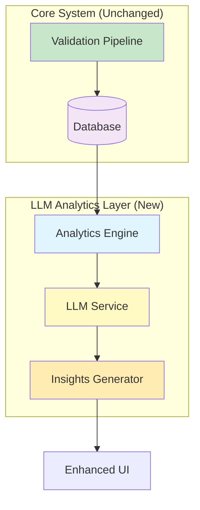

# LLM Analytics Enhancement Plan

## 🎯 Overview

Add LLM-powered analytics as an **optional enhancement layer** that provides insights WITHOUT affecting the core deterministic validation system.

**Key Principle:** LLM analytics are **advisory only** - they never change validation decisions or scores.

---

## 🏗️ Architecture



---

## 📊 LLM Analytics Features

### 1. **Trend Analysis & Predictions** 🔮
**What:** Analyze historical validation patterns to predict future trends

**Use Cases:**
- "Based on last 30 days, rejection rate is increasing by 15%"
- "Manual review cases spike on Mondays - consider staffing adjustments"
- "HbA1c-related flags increased 40% this quarter"

**Implementation:**
```python
def analyze_trends(results_df, llm_client):
    """Use LLM to identify patterns in validation history."""
    prompt = f"""
    Analyze these medical chart validation results:
    {results_df.to_json()}
    
    Identify:
    1. Trends in approval/rejection rates
    2. Common flag patterns
    3. Time-based patterns
    4. Recommendations for process improvement
    """
    return llm_client.generate(prompt)
```

---

### 2. **Root Cause Analysis** 🔍
**What:** Explain WHY certain patterns occur

**Use Cases:**
- "High rejection rate for MBR002-type cases due to ICD code mismatches"
- "Manual reviews cluster around date discrepancies >180 days"
- "Provider NPI missing in 23% of rejected cases"

**Implementation:**
```python
def root_cause_analysis(filtered_results, llm_client):
    """Identify root causes for specific decision patterns."""
    prompt = f"""
    These charts were rejected/flagged:
    {json.dumps(filtered_results)}
    
    Identify:
    1. Common root causes
    2. Preventable issues
    3. Data quality problems
    4. Training opportunities
    """
    return llm_client.generate(prompt)
```

---

### 3. **Natural Language Queries** 💬
**What:** Ask questions about validation data in plain English

**Use Cases:**
- "Which members have the most manual reviews?"
- "What's the average gap score for approved cases?"
- "Show me all diabetes-related rejections this month"

**Implementation:**
```python
def natural_language_query(question, results_df, llm_client):
    """Convert natural language to SQL/pandas query."""
    prompt = f"""
    Database schema:
    {get_schema()}
    
    User question: {question}
    
    Generate pandas/SQL query to answer this.
    """
    query = llm_client.generate(prompt)
    return execute_query(query, results_df)
```

---

### 4. **Automated Insights & Alerts** 🚨
**What:** Proactive notifications about anomalies

**Use Cases:**
- "Alert: Rejection rate jumped 50% in last 24 hours"
- "Insight: New flag type appearing - 'Lab date >365 days'"
- "Recommendation: Review Provider NPI 1234567890 - 80% rejection rate"

**Implementation:**
```python
def generate_alerts(current_summary, historical_summary, llm_client):
    """Compare current vs historical to find anomalies."""
    prompt = f"""
    Current metrics: {current_summary}
    Historical baseline: {historical_summary}
    
    Identify:
    1. Significant deviations
    2. Emerging patterns
    3. Actionable alerts
    """
    return llm_client.generate(prompt)
```

---

### 5. **Decision Explanation Enhancement** 📝
**What:** Human-friendly explanations of algorithmic decisions

**Use Cases:**
- Convert "Score 0.77 (base 0.8 - penalty 0.03)" to:
  "Chart routed to manual review because the lab date was 200 days old (medium severity), slightly reducing the otherwise strong match score."

**Implementation:**
```python
def explain_decision(result, llm_client):
    """Generate human-friendly explanation."""
    prompt = f"""
    Validation result:
    - Decision: {result['decision']}
    - Score: {result['confidence']}
    - Flags: {result['flags']}
    - Reasoning: {result['reasoning']}
    
    Explain this decision in simple terms for:
    1. Healthcare provider
    2. Quality reviewer
    3. Member services rep
    """
    return llm_client.generate(prompt)
```

---

### 6. **Comparative Analysis** 📊
**What:** Compare performance across dimensions

**Use Cases:**
- "Compare approval rates by provider"
- "Gap closure success by diagnosis type"
- "Time-to-decision trends by complexity"

**Implementation:**
```python
def comparative_analysis(dimension, results_df, llm_client):
    """Generate comparative insights."""
    grouped = results_df.groupby(dimension).agg({
        'decision': 'value_counts',
        'confidence': 'mean',
        'disc_count': 'mean'
    })
    
    prompt = f"""
    Comparison by {dimension}:
    {grouped.to_json()}
    
    Provide:
    1. Key differences
    2. Outliers
    3. Recommendations
    """
    return llm_client.generate(prompt)
```

---

## 🛠️ Implementation Plan

### Phase 1: Foundation (2-3 hours)

**1. Create LLM Service Module (Using Groq Free Tier)**
```python
# llm_service.py
import os
from groq import Groq

class LLMAnalytics:
    def __init__(self, api_key=None, model="llama-3.1-70b-versatile"):
        """
        Initialize Groq LLM client with free tier.
        
        Available free models:
        - llama-3.1-70b-versatile (recommended for analytics)
        - llama-3.1-8b-instant (faster, lighter tasks)
        - mixtral-8x7b-32768 (alternative)
        """
        self.client = Groq(api_key=api_key or os.getenv("GROQ_API_KEY"))
        self.model = model
    
    def generate(self, prompt, max_tokens=500):
        """Generate LLM response using Groq."""
        try:
            response = self.client.chat.completions.create(
                model=self.model,
                messages=[{"role": "user", "content": prompt}],
                max_tokens=max_tokens,
                temperature=0.7
            )
            return response.choices[0].message.content
        except Exception as e:
            return f"Error generating response: {str(e)}"
    
    def analyze_trends(self, results_df):
        """Analyze validation trends."""
        # Implementation from above
        pass
    
    def explain_decision(self, result):
        """Generate human-friendly explanation."""
        # Implementation from above
        pass
```

**2. Add Database Functions**
```python
# db.py additions
def get_results_for_analysis(days=30):
    """Get recent results for trend analysis."""
    conn = sqlite3.connect(DB_PATH)
    query = f"""
        SELECT * FROM results 
        WHERE created_at >= date('now', '-{days} days')
        ORDER BY created_at DESC
    """
    df = pd.read_sql_query(query, conn)
    conn.close()
    return df

def get_historical_baseline(days=90):
    """Get historical metrics for comparison."""
    conn = sqlite3.connect(DB_PATH)
    query = f"""
        SELECT 
            DATE(created_at) as date,
            decision,
            COUNT(*) as count,
            AVG(confidence) as avg_confidence
        FROM results
        WHERE created_at >= date('now', '-{days} days')
        GROUP BY DATE(created_at), decision
    """
    df = pd.read_sql_query(query, conn)
    conn.close()
    return df
```

---

### Phase 2: UI Integration (2-3 hours)

**Add Tab 4: "🤖 AI Insights"**

```python
# app.py - Add new tab
tab1, tab2, tab3, tab4 = st.tabs([
    "📋 Validate", 
    "📊 Results", 
    "📈 Dashboard",
    "🤖 AI Insights"  # NEW
])

with tab4:
    st.header("🤖 AI-Powered Analytics")
    st.caption("Optional LLM-powered insights - does not affect validation decisions")
    
    # API Key input
    api_key = st.text_input(
        "Groq API Key (Free Tier)",
        type="password",
        help="Get your free API key at https://console.groq.com"
    )
    
    if not api_key:
        st.info("👆 Enter an API key above to unlock AI-powered analytics")
        st.stop()
    
    # Initialize LLM service
    llm = LLMAnalytics(api_key=api_key)
    
    # Section 1: Trend Analysis
    st.subheader("📈 Trend Analysis")
    if st.button("Analyze Trends"):
        with st.spinner("Analyzing validation patterns..."):
            results_df = db.get_results_for_analysis(days=30)
            insights = llm.analyze_trends(results_df)
            st.markdown(insights)
    
    st.divider()
    
    # Section 2: Natural Language Query
    st.subheader("💬 Ask Questions")
    question = st.text_input("Ask about your validation data:")
    if question:
        with st.spinner("Thinking..."):
            results_df = db.get_all_results()
            answer = llm.natural_language_query(question, results_df)
            st.markdown(answer)
    
    st.divider()
    
    # Section 3: Root Cause Analysis
    st.subheader("🔍 Root Cause Analysis")
    analysis_type = st.selectbox(
        "Analyze:",
        ["Rejected Cases", "Manual Review Cases", "High Flag Count"]
    )
    if st.button("Analyze Root Causes"):
        with st.spinner("Identifying patterns..."):
            filtered = filter_results_by_type(analysis_type)
            analysis = llm.root_cause_analysis(filtered)
            st.markdown(analysis)
```

---

### Phase 3: Enhanced Features (3-4 hours)

**1. Add "Explain" Button to Results**
```python
# In Tab 2 (Results), add to each result expander:
if st.button(f"🤖 AI Explanation", key=f"explain_{result['id']}"):
    if 'llm_service' in st.session_state:
        explanation = st.session_state.llm_service.explain_decision(result)
        st.info(explanation)
    else:
        st.warning("Enable AI Insights in Tab 4 first")
```

**2. Add Automated Alerts to Dashboard**
```python
# In Tab 3 (Dashboard), add alert section:
if 'llm_service' in st.session_state:
    st.subheader("🚨 AI-Detected Alerts")
    current = db.get_summary()
    historical = db.get_historical_baseline()
    alerts = st.session_state.llm_service.generate_alerts(current, historical)
    
    for alert in alerts:
        if alert['severity'] == 'high':
            st.error(f"⚠️ {alert['message']}")
        elif alert['severity'] == 'medium':
            st.warning(f"⚡ {alert['message']}")
        else:
            st.info(f"💡 {alert['message']}")
```

---

## 📦 Dependencies

Add to `requirements.txt`:
```txt
groq>=0.4.0  # Free tier with Llama 3.1 models
```

**Setup Instructions:**
1. Install: `pip install groq`
2. Get free API key: https://console.groq.com
3. Set environment variable (optional): `export GROQ_API_KEY=your_key_here`

---

## 🔒 Security & Privacy

### 1. **API Key Management**
- Never store API keys in code
- Use environment variables or secure input in Streamlit
- Groq API key is free but should still be protected
- Option to use local LLM (Ollama, LM Studio) for zero external calls

### 2. **Data Privacy**
- ⚠️ **Important:** Groq is a cloud service - data is sent to external servers
- Anonymize member IDs before sending to LLM
- Remove PHI (Protected Health Information) from prompts
- For maximum privacy, use Ollama (local) instead
- Clear disclosure that data leaves system when using Groq

### 3. **Rate Limiting**
- Groq free tier: 6000 requests/minute (very generous)
- Cache LLM responses to reduce redundant calls
- Implement request throttling for safety
- Monitor usage via Groq console

---

## 💰 Cost Estimation

**Using Groq Free Tier (Recommended):**
- ✅ **$0/month** - Completely FREE
- Trend analysis: FREE
- Decision explanation: FREE per chart
- Natural language query: FREE per question
- Rate limits: Generous free tier (6000 requests/minute for Llama 3.1)

**Groq Free Tier Models:**
- `llama-3.1-70b-versatile` - Best for complex analytics (recommended)
- `llama-3.1-8b-instant` - Faster for simple tasks
- `mixtral-8x7b-32768` - Alternative with large context

**Other Free Alternatives:**
- Ollama (local, 100% private)
- LM Studio (local, GUI-based)
- Hugging Face Inference API (free tier)

---

## 🎯 Success Metrics

### Quantitative:
- Time saved in manual review (target: 30%)
- Faster root cause identification (target: 50%)
- Improved decision understanding (survey-based)

### Qualitative:
- User satisfaction with explanations
- Actionability of insights
- Trust in AI recommendations

---

## 🚀 Rollout Strategy

### Week 1: Pilot
- Enable for 5 power users
- Gather feedback
- Refine prompts

### Week 2-3: Beta
- Expand to 25% of users
- Monitor costs
- Add requested features

### Week 4: General Availability
- Full rollout
- Documentation
- Training materials

---

## 🔄 Future Enhancements

1. **Predictive Modeling**
   - Predict which charts will need manual review
   - Forecast rejection rates

2. **Automated Report Generation**
   - Weekly summary emails
   - Executive dashboards
   - Compliance reports

3. **Interactive Chat**
   - Conversational interface
   - Follow-up questions
   - Drill-down analysis

4. **Multi-modal Analysis**
   - Analyze actual chart images
   - Extract from unstructured PDFs
   - OCR enhancement

---

## 📝 Example Prompts

### Trend Analysis
```
Analyze these validation results from the past 30 days:
- Total: 450 charts
- Approved: 320 (71%)
- Rejected: 80 (18%)
- Manual Review: 50 (11%)

Key flags:
- HbA1c date gaps: 45 cases
- Missing NPI: 23 cases
- Unknown ICD codes: 12 cases

Provide:
1. Notable trends
2. Potential issues
3. Actionable recommendations
```

### Decision Explanation
```
Explain this validation decision in simple terms:

Chart: MBR003
Decision: Manual Review
Score: 0.77
Reason: "1 high-severity flag(s) found"
Flags: "Lab date 2023-03-10 is 631 days from visit"

Explain for:
1. Healthcare provider (clinical perspective)
2. Quality reviewer (compliance perspective)
3. Member services (patient-friendly language)
```

---

## ✅ Implementation Checklist

- [ ] Create `llm_service.py` module
- [ ] Add LLM dependencies to requirements.txt
- [ ] Extend `db.py` with analytics queries
- [ ] Add Tab 4 "AI Insights" to app.py
- [ ] Implement trend analysis feature
- [ ] Implement natural language query
- [ ] Implement root cause analysis
- [ ] Add "Explain" buttons to results
- [ ] Add automated alerts to dashboard
- [ ] Test with sample data
- [ ] Document API key setup
- [ ] Create user guide
- [ ] Add cost monitoring
- [ ] Implement caching
- [ ] Security review

---

## 🎓 Key Principles

1. **Non-Invasive:** LLM never changes validation logic
2. **Optional:** System works perfectly without LLM
3. **Transparent:** Always show LLM is being used
4. **Auditable:** Log all LLM interactions
5. **Cost-Conscious:** Cache aggressively, use cheaper models where possible
6. **Privacy-First:** Anonymize data, offer local LLM options

---

**This approach gives you the best of both worlds:**
- ✅ Deterministic, auditable core validation
- ✅ Intelligent, adaptive analytics layer
- ✅ No compromise on reliability
- ✅ Enhanced user experience